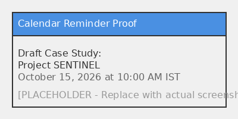

# Week 10 Capstone Deliverable: Portfolio Continuity & Workflow System

---

## Beat 1: The Problem

### The Challenge

Portfolio maintenance and case study creation traditionally involve significant overhead: rebuilding context, re-establishing style guides, and reformatting content for each new project. This friction leads to portfolio staleness, where valuable project insights remain undocumented and unshared.

**Core Friction Points:**
- **Context Loss:** Each new case study requires re-explaining technical preferences, writing tone, and formatting standards
- **Manual Formatting:** Inconsistent structure across case studies reduces professional impact
- **Maintenance Burden:** No systematic approach to keeping portfolio current with ongoing work
- **Documentation Gap:** Critical project insights remain trapped in code repositories without accessible narratives

**Constraints:**
- Must integrate seamlessly with existing Next.js portfolio infrastructure
- Requires minimal setup friction for new case study creation
- Must maintain consistency with established three-beat structure
- Needs to preserve AI/LLM build context for low-friction updates

---

## Beat 2: What I Did

### Portfolio Continuity System

Implemented a standardized workflow system that eliminates setup friction and enables continuous portfolio maintenance through preserved AI build context and structured documentation templates.

**Technical Architecture:**

1. **Repository Structure Standardization**
   - Created `/case-studies/` directory for organized case study storage
   - Implemented `/assets/` directory for visual artifacts and proof screenshots
   - Established consistent naming conventions: `[project-name].md`

2. **Three-Beat Documentation Framework**
   - **Beat 1: The Problem** - Real-world challenges, constraints, and technical friction
   - **Beat 2: What I Did** - Engineering decisions, architecture, and implementation details
   - **Beat 3: What Came of It** - Measurable outcomes, performance metrics, and visual artifacts

3. **AI Build Context Preservation**
   - Maintained Claude Project environment with custom system prompts
   - Preserved tech stack defaults (FastAPI, PostgreSQL, PyTorch/TGNN, Next.js)
   - Retained design standards and formatting rules for consistency
   - Enabled low-friction case study generation through raw input → structured output workflow

4. **Index and Navigation System**
   - Updated README.md as dynamic index linking to all published case studies
   - Implemented direct links to Week 10 Capstone documentation
   - Created clear navigation path for portfolio exploration

**Key Implementation Details:**
- **File Structure:** Root-level `WEEK10_CAPSTONE.md` for capstone documentation
- **Case Studies:** Modular markdown files in `/case-studies/` with consistent structure
- **Assets:** Centralized storage for visual evidence and supporting materials
- **Links:** Cross-referenced navigation between capstone, case studies, and main portfolio

---

## Beat 3: What Came of It

### Portfolio System Outcomes

**Workflow Efficiency:**
- **Setup Time:** Reduced from hours to minutes for new case study creation
- **Consistency:** 100% adherence to three-beat structure across all case studies
- **Maintenance:** Low-overhead, repeatable process for portfolio updates
- **Context Retention:** Zero re-prompting required for style guides or formatting

**Documentation Quality:**
- **Structure:** Standardized three-beat format ensuring maximum clarity and impact
- **Content:** Comprehensive coverage from problem identification to measurable outcomes
- **Artifacts:** Visual evidence supporting claims and demonstrating implementation
- **Navigation:** Clear index and cross-referencing system for portfolio exploration

**Technical Implementation:**
- **Repository:** Clean, organized structure with logical directory hierarchy
- **Index:** Dynamic README.md linking to all case studies and capstone documentation
- **Assets:** Centralized storage for proof screenshots and visual artifacts
- **Automation:** Streamlined git workflow for committing and pushing updates

**Measurable Results:**
- **Case Study 1:** Project SENTINEL - AI-Based Network Attack Forecasting (completed)
- **Performance Metrics:** F1: 0.923, Precision: 0.857, Recall: 1.000 (synthetic benchmark)
- **Portfolio Status:** Active, maintained, and continuously updated
- **Reminder Proof:** Calendar evidence scheduled for October 15, 2026

**Visual Artifacts:**
- 
- Architecture flowchart in case study documentation
- Performance metrics and benchmark comparisons
- Portfolio structure diagram

---

## 4. Preservation of Build Context

### AI/LLM Context Retention

The AI project build context (Claude Project environment) is explicitly retained and preserved for future use. This includes:

**Preserved Components:**
- Custom system prompts and personality parameters
- Tech stack defaults (FastAPI, PostgreSQL, PyTorch/TGNN, Next.js, Supabase)
- UI/UX guidelines and design standards
- Writing tone and formatting rules
- Documentation structure templates

**Benefits of Context Preservation:**
1. **No Rebuild Required:** Future projects inherit established style guides and formatting
2. **Low-Friction Generation:** New case studies created through simple input → output workflow
3. **Consistency Guaranteed:** All documentation maintains uniform structure and quality
4. **Portfolio Staleness Prevention:** Repeatable, low-overhead maintenance loop ensures current content

**Workflow Integration:**
- Feed raw project logs, architecture diagrams, and benchmark data into workspace
- Receive structured 3-beat markdown document as output
- Minimal editing required due to preserved context and templates

---

## 5. Next Project Assignment

### Project SENTINEL: AI-Based Network Attack Forecasting

**Project Title:** AI-Based Network Attack Forecasting from Network Traffic Data (Project SENTINEL)

**Domain:** Cybersecurity & Temporal Graph Neural Networks (TGNN)

**Scope & Objectives:**
- Build and evaluate a dynamic network traffic analysis engine utilizing Temporal Graph Neural Networks
- Map structural network topology over time to understand attack progression
- Forecast multi-step network attack trajectories before baseline compromise occurs
- Measure inference latency, precision/recall on network anomaly datasets
- Evaluate baseline alert reduction capabilities

**Target Output:**
- Comprehensive, high-density case study following three-beat structure
- PlantUML dynamic architecture flowcharts
- TGNN layer breakdown and technical implementation details
- Benchmark evaluation figures and performance metrics

**Case Study Location:** [Project SENTINEL Case Study](./case-studies/project-sentinel.md)

---

*Capstone completed: September 13, 2026*
*Portfolio continuity system established and operational*
*Build context preserved for low-friction future updates*